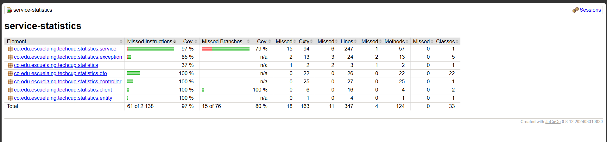

# ga-statistics-service

Microservicio de **Estadísticas** de TECHCUP FÚTBOL. Centraliza el cálculo y la consulta
de estadísticas de jugadores, equipos, partidos y torneos, a partir de los eventos
generados durante los partidos (goles, asistencias, faltas, tarjetas, minutos jugados,
portería y resultado).

Forma parte de la arquitectura de microservicios del proyecto.

## Stack

- Java 21
- Spring Boot 3.5.6 (Web, Data MongoDB, Validation)
- MongoDB
- Lombok
- JUnit 5 + Mockito + AssertJ (tests)

## Arquitectura del servicio

El dato atómico es `PlayerMatchStat`: el desempeño de **un jugador** en **un partido**,
guardado como documento en MongoDB. Los promedios, totales y rankings no se calculan con
`AVG`/`SUM`/`GROUP BY` en la base de datos (como sí se podría en SQL): el repositorio
solo trae los documentos que hagan falta, y `StatisticsServiceImpl` hace los cálculos
con streams de Java. Es la forma más simple de mantener para el volumen de datos de un
torneo universitario.

El reconocimiento del torneo (`TournamentRecognition`) es la única excepción: se calcula
una vez y se **guarda** como su propio documento, en vez de recalcularse en cada consulta
(ver sección de Reconocimientos más abajo).

```
controller/   -> Endpoints REST
service/      -> Lógica de negocio (promedios, totales, rankings, agregaciones)
repository/   -> Acceso a datos (Spring Data MongoDB)
entity/       -> Documentos persistentes (PlayerMatchStat, MatchResult, TournamentRecognition)
dto/          -> Contratos de entrada/salida (requests y responses)
exception/    -> Manejo centralizado de errores
client/       -> Cliente HTTP hacia el servicio de Torneos
```

## Cómo levantarlo localmente

### 1. Base de datos

Necesitas una instancia de MongoDB corriendo (local, Docker, o Atlas). No hace falta
crear la base de datos ni las colecciones de antemano — MongoDB las crea automáticamente
al guardar el primer documento.

Con Docker:
```bash
docker run -d --name techcup-mongo -p 27017:27017 mongo:7
```

### 2. Variables de entorno

| Variable       | Default                                              | Descripción                        |
|----------------|--------------------------------------------------------|--------------------------------------|
| `MONGODB_URI`  | `mongodb://localhost:27017/techcup_statistics`        | URI de conexión a MongoDB            |
| `SERVER_PORT`  | `8085`                                                 | Puerto en el que corre la app        |
| `TOURNAMENTS_SERVICE_URL` | `http://localhost:8081`                    | Base URL del servicio de Torneos     |

### 3. Correrlo

```powershell
# Windows (PowerShell)
$env:MONGODB_URI="mongodb://localhost:27017/techcup_statistics"
mvn spring-boot:run
```
```bash
# Linux / Mac
export MONGODB_URI="mongodb://localhost:27017/techcup_statistics"
./mvnw spring-boot:run
```

## Correr los tests

```bash
mvn test
```

> Nota: `ServiceStatisticsApplicationTests` levanta el contexto completo de Spring y
> necesita conexión real a MongoDB, así que exporta `MONGODB_URI` (si no usas el valor
> por defecto) antes de correr los tests igual que al levantar la app.

## Ingesta de eventos (interno — lo consume el servicio de Competencia)

**`POST /api/v1/statistics/events`**

Se llama una vez finaliza un partido, con el resumen de **un jugador** en ese partido.

```json
{
  "playerId": 1,
  "teamId": 10,
  "matchId": 100,
  "tournamentId": 1,
  "result": "WON",
  "goals": 2,
  "assists": 1,
  "yellowCards": 1,
  "redCards": 0,
  "foulsCommitted": 3,
  "minutesPlayed": 90,
  "goalkeeper": false
}
```

| Campo | Obligatorio | Notas |
|---|---|---|
| `playerId`, `teamId`, `matchId`, `tournamentId` | Sí | |
| `result` | Sí | `WON`, `DRAWN` o `LOST`. Para **walkover** (equipo no se presenta): el equipo presente se registra como `WON` y el ausente como `LOST` — no hay un valor especial, es una regla de uso, no un campo nuevo. |
| `goals`, `assists`, `yellowCards`, `redCards`, `foulsCommitted`, `minutesPlayed` | No | Si no se envían, se guardan como `0` |
| `goalkeeper` | No | `true` si este jugador jugó de portero en este partido. Default `false`. Se usa para el ranking de "valla menos vencida" |

Reglas:
- Un mismo `playerId` + `matchId` **no puede registrarse dos veces**: si Competencia
  reintenta el envío, el servicio responde `409 Conflict`.

Respuestas: `201 Created` | `400 Bad Request` (validación) | `409 Conflict` (duplicado)

---

## Endpoints de consulta

Base path: `/api/v1/statistics`. Todos los endpoints que reciben `tournamentId` lo
aceptan como parámetro **opcional**: si no se envía, la consulta es **histórica** (todos
los torneos), salvo que se indique lo contrario.

### Jugador

| Método | Endpoint | Descripción |
|--------|----------|-------------|
| GET | `/players/{playerId}/average-win-rate` | % de partidos ganados |
| GET | `/players/{playerId}/average-goals` | Promedio de goles por partido |
| GET | `/players/{playerId}/average-fouls` | Promedio de faltas por partido |
| GET | `/players/{playerId}/average-minutes-played` | Promedio de minutos jugados por partido |
| GET | `/players/{playerId}/matches-played` | Número total de partidos jugados |
| GET | `/players/{playerId}/total-goals` | Goles hechos (total, no promedio) |
| GET | `/players/{playerId}/total-fouls` | Faltas cometidas (total) |
| GET | `/players/{playerId}/assists` | Asistencias (total) |
| GET | `/players/{playerId}/cards` | Tarjetas amarillas y rojas acumuladas |

Ejemplo (`average-goals`):
```json
{ "playerId": 1, "tournamentId": null, "metric": "averageGoals", "value": 1.67, "matchesConsidered": 3 }
```
Ejemplo (`total-goals`, `total-fouls`, `assists` — misma forma):
```json
{ "ownerId": 1, "tournamentId": null, "metric": "totalGoals", "total": 5, "matchesConsidered": 3 }
```
Ejemplo (`cards`):
```json
{ "playerId": 1, "tournamentId": null, "yellowCards": 2, "redCards": 0 }
```

### Equipo

| Método | Endpoint | Descripción |
|--------|----------|-------------|
| GET | `/teams/{teamId}/statistics` | Estadísticas completas **en el torneo activo** (le pregunta a Torneos cuál es) |
| GET | `/teams/{teamId}/match-record` | Partidos G/E/P con porcentajes |
| GET | `/teams/{teamId}/average-goals` | Promedio de goles del equipo por partido |
| GET | `/teams/{teamId}/average-fouls` | Promedio de faltas del equipo por partido |
| GET | `/teams/{teamId}/total-fouls` | Faltas totales cometidas por el equipo |
| GET | `/teams/{teamId}/goals` | Goles a favor, en contra y diferencia |

`/teams/{teamId}/statistics` es el único que **no** acepta `tournamentId` — siempre
resuelve el torneo activo llamando al servicio de Torneos. Si ese servicio no responde,
devuelve `502 Bad Gateway`.

Ejemplo (`/teams/{id}/statistics` o `/goals`):
```json
{
  "teamId": 10, "tournamentId": 1, "matchesPlayed": 2, "wins": 1, "draws": 0, "losses": 1,
  "goalsFor": 2, "goalsAgainst": 1, "goalDifference": 1, "points": 3
}
```
Ejemplo (`match-record`):
```json
{
  "teamId": 10, "tournamentId": 1, "matchesPlayed": 2, "wins": 1, "draws": 0, "losses": 1,
  "winRatePercentage": 50.0, "drawRatePercentage": 0.0, "lossRatePercentage": 50.0
}
```

### Torneo

| Método | Endpoint | Descripción |
|--------|----------|-------------|
| GET | `/tournaments/{tournamentId}/standings` | Tabla de posiciones completa (equipos, puntos, resultados) |
| GET | `/rankings?type={TYPE}&tournamentId=&limit=` | Ranking público de jugadores (ver detalle abajo) |
| GET | `/goalkeeper-ranking?tournamentId=&limit=` | Ranking de porteros por menos goles recibidos ("valla menos vencida") |
| GET | `/tournaments/{tournamentId}/match-averages` | Promedio de goles, faltas y tarjetas por partido en TODO el torneo |
| GET | `/tournaments/{tournamentId}/cards` | Tarjetas totales del torneo |
| POST | `/tournaments/{tournamentId}/recognitions` | Genera y guarda el reconocimiento del torneo (ver detalle abajo) |
| GET | `/tournaments/{tournamentId}/recognitions` | Consulta el reconocimiento ya guardado |

#### `GET /rankings?type={TYPE}`

| Parámetro | Obligatorio | Default | Descripción |
|---|---|---|---|
| `type` | Sí | — | `GOALS`, `WINS`, `FOULS` o `MINUTES` |
| `tournamentId` | No | histórico | Filtra a un torneo |
| `limit` | No | `10` | Top N |

- `GOALS`: más goles primero (botín de oro)
- `WINS`: más partidos ganados primero
- `FOULS`: **menos** faltas primero (tabla de juego limpio)
- `MINUTES`: más minutos acumulados primero

```json
{ "type": "GOALS", "tournamentId": null, "entries": [{ "position": 1, "playerId": 1, "value": 8 }] }
```

#### `GET /goalkeeper-ranking`

Similar a `/rankings`, pero fijo a porteros. Solo cuentan los partidos donde el jugador
se marcó con `"goalkeeper": true` en el evento; el valor es la suma de goles recibidos
por su equipo en esos partidos.

```json
{ "tournamentId": 1, "entries": [{ "position": 1, "playerId": 8, "goalsConceded": 0 }] }
```

#### `GET /tournaments/{tournamentId}/match-averages`

Promedios calculados sobre **todos los partidos** del torneo (no por jugador ni equipo).

```json
{
  "tournamentId": 1, "matchesConsidered": 12,
  "averageGoalsPerMatch": 2.8, "averageFoulsPerMatch": 9.1, "averageCardsPerMatch": 3.2
}
```

#### Reconocimientos (`POST` / `GET /tournaments/{tournamentId}/recognitions`)

A diferencia de todos los demás endpoints, **el reconocimiento no se calcula al
consultarlo**: se calcula y se **guarda** una sola vez, disparado por un `POST` — pensado
para que el servicio de Torneos lo llame automáticamente cuando el torneo finaliza.

- `POST`: calcula el máximo goleador y la malla menos vencida (por equipo) del torneo, y
  los guarda. Si ya existía un reconocimiento para ese torneo, lo **reemplaza**. Devuelve
  `201 Created` con el resultado.
- `GET`: devuelve el reconocimiento ya guardado. Si el torneo todavía no ha finalizado
  (nadie ha llamado al `POST`), devuelve `404 Not Found`.
- **Empates**: si dos o más jugadores comparten el máximo de goles, o dos o más equipos
  comparten la menor cantidad de goles recibidos, **se publican todos los empatados** en
  la lista (no se elige un solo "ganador" arbitrariamente).

```json
{
  "tournamentId": 2,
  "topScorers": [{ "playerId": 5, "goals": 2 }, { "playerId": 6, "goals": 2 }],
  "topScorersGoals": 2,
  "bestDefenseTeams": [{ "teamId": 50, "goalsAgainst": 0 }],
  "bestDefenseGoalsAgainst": 0,
  "generatedAt": "2026-07-14T11:19:16.149"
}
```

### Partido

| Método | Endpoint | Descripción |
|--------|----------|-------------|
| GET | `/matches/{matchId}/cards` | Tarjetas totales de ese partido específico |
| GET | `/matches/{matchId}/result` | Resultado del partido, por equipo |

```json
// /matches/{id}/cards
{ "scope": "match", "id": 200, "yellowCards": 1, "redCards": 0 }
```
```json
// /matches/{id}/result
{
  "matchId": 200, "tournamentId": 2,
  "teamResults": [{ "teamId": 50, "result": "WON" }, { "teamId": 51, "result": "LOST" }]
}
```

---

## Manejo de errores

Todas las respuestas de error siguen el mismo formato:
```json
{
  "timestamp": "2026-07-09T08:03:32.23",
  "status": 409,
  "error": "Conflict",
  "messages": ["Ya existe una estadística registrada para el jugador 1 en el partido 100"],
  "path": "/api/v1/statistics/events"
}
```

| Situación | Status |
|---|---|
| Evento duplicado (mismo jugador + partido) | 409 |
| Validación de campos del evento | 400 |
| Reconocimiento aún no generado | 404 |
| Servicio de Torneos no disponible / sin torneo activo | 502 |
| Error inesperado | 500 |

## Cobertura de tests

El proyecto usa [JaCoCo](https://www.jacoco.org/jacoco/) para medir cobertura de tests.
Cobertura actual: **97% de instrucciones, 80% de ramas** (66 tests: servicio, controlador
y cliente HTTP).

| Paquete | Cobertura |
|---|---|
| `dto` | 100% |
| `controller` | 100% |
| `client` | 100% |
| `entity` | 100% |
| `service` | 97% |
| `exception` | 85% |



### Cómo generar el reporte

```bash
mvn test
```

El reporte HTML se genera en `target/site/jacoco/index.html` (ábrelo en el navegador).


## Flujo de ramas del equipo

Este repositorio sigue un flujo simplificado tipo Gitflow:

- `main`: siempre estable, versión entregable.
- `develop`: rama de integración del equipo.
- `feature/<nombre>`: una rama por tarea, creada desde `develop`. Al terminar, se abre
  un Pull Request hacia `develop`.

## Contratos pendientes de confirmar con otros equipos

- **Competencia**: debe enviar `assists` y `goalkeeper` en el evento de `/events` (ambos
  opcionales, pero necesarios para que funcionen las asistencias y el ranking de porteros).
- **Torneos**: debe exponer `GET /api/v1/tournaments/active` (usado por
  `/teams/{id}/statistics`) y llamar a `POST /tournaments/{id}/recognitions` cuando
  finalice un torneo.