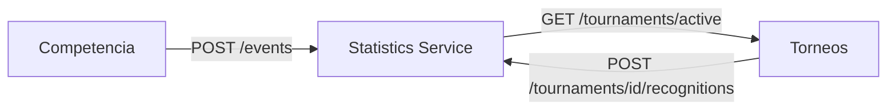

# Architecture

## Layers

```
controller/   -> REST endpoints (annotated with Swagger/OpenAPI)
service/      -> Business logic: averages, totals, rankings, aggregations
repository/   -> Data access (Spring Data MongoDB)
entity/       -> Persistent documents (PlayerMatchStat, TournamentRecognition)
dto/          -> Input/output contracts
exception/    -> Centralized error handling
client/       -> HTTP client to the Tournament service
```

## Data model

The atomic document is `PlayerMatchStat`: the performance of **one player** in **one match**. All calculations are derived from this — there are no separate tables/collections for each type of statistic.

MongoDB does not offer `AVG`/`SUM`/`GROUP BY` aggregations as easily as SQL, so the design decision was: the repository fetches the raw documents needed, and `StatisticsServiceImpl` computes averages, sums, and groupings using Java streams. This is a conscious trade-off between raw efficiency and maintenance simplicity — valid for the data volume of a university tournament.

The only exception is `TournamentRecognition`: it is computed once (triggered by `POST /tournaments/{id}/recognitions`) and **persisted**, instead of being recalculated on every query.

### IDs as String

`playerId`, `teamId`, `matchId`, and `tournamentId` are `String`, not `Long`. Other microservices in the TechCup ecosystem (Tournaments, Teams, Users) use MongoDB with `ObjectId` IDs (e.g. `"64f1a2b3c4d5e6f7a8b9c0d1"`), so this service aligned with that format for integration.

## Integration with other microservices



- **Competition → Statistics**: when a match finishes, Competition sends each player's summary via `POST /events`.
- **Tournaments → Statistics**: when a tournament finishes, Tournaments should call `POST /tournaments/{id}/recognitions` to trigger recognition computation.
- **Statistics → Tournaments**: to resolve "the active tournament" (used in `GET /teams/{id}/statistics`), this service queries Tournaments.

!!! warning "Contracts pending confirmation (verified 2026-07-14)"
    Reviewing the actual `mk-tournament-service` code:

    - **`GET /tournaments/active` does not exist**. Tournaments exposes routes like `/tournaments/{id}/finalize` or `/tournaments/history`, but none that returns "the currently active tournament". Pending the Tournaments team to add it, or redesigning this flow so callers pass `tournamentId` explicitly.
    - **Recognition hook exists but is a stub**: `RecognitionAwardPort.triggerAwards(String tournamentId)` is invoked automatically from `FinalizeTournamentService` without blocking tournament finalization if it fails. However, its only implementation is a `LogRecognitionAwardAdapter` that just logs — the real HTTP call to `POST /tournaments/{id}/recognitions` is never made.
    - The Tournament service runs on port **8080** (not 8081 as initially assumed), and its routes have no `/api/v1` prefix.

## Security

This service does not implement authentication or authorization — access control (JWT, roles) is assumed to be handled by the API Gateway or Identity service before requests reach here. All query endpoints are read-only and public within the system's internal network.
