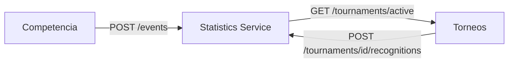

# Arquitectura

## Capas

```
controller/   -> Endpoints REST (anotados con Swagger/OpenAPI)
service/      -> Lógica de negocio: promedios, totales, rankings, agregaciones
repository/   -> Acceso a datos (Spring Data MongoDB)
entity/       -> Documentos persistentes (PlayerMatchStat, TournamentRecognition)
dto/          -> Contratos de entrada/salida
exception/    -> Manejo centralizado de errores
client/       -> Cliente HTTP hacia el servicio de Torneos
```

## Modelo de datos

El documento atómico es `PlayerMatchStat`: el desempeño de **un jugador** en **un
partido**. A partir de ahí se derivan todos los cálculos — no hay tablas/colecciones
separadas por cada tipo de estadística.

MongoDB no ofrece agregaciones tipo `AVG`/`SUM`/`GROUP BY` con la misma facilidad que
SQL, así que la decisión de diseño fue: el repositorio solo trae los documentos crudos
que hagan falta, y `StatisticsServiceImpl` calcula promedios, sumas y agrupaciones con
streams de Java. Es una compensación consciente entre eficiencia bruta y simplicidad de
mantenimiento — válida para el volumen de datos de un torneo universitario.

La única excepción es `TournamentRecognition`: se calcula una sola vez (disparado por
`POST /tournaments/{id}/recognitions`) y se **guarda**, en vez de recalcularse en cada
consulta.

### IDs como String

`playerId`, `teamId`, `matchId` y `tournamentId` son `String`, no `Long`. Los demás
microservicios del ecosistema TechCup (Torneos, Equipos, Usuarios) usan MongoDB con IDs
tipo `ObjectId` (ej. `"64f1a2b3c4d5e6f7a8b9c0d1"`), así que este servicio tuvo que
alinearse a ese formato para poder integrarse con ellos.

## Integración con otros microservicios



- **Competencia → Estadísticas**: al finalizar un partido, Competencia envía el resumen
  de cada jugador vía `POST /events`.
- **Torneos → Estadísticas**: al finalizar un torneo, Torneos debería llamar a
  `POST /tournaments/{id}/recognitions` para disparar el cálculo del reconocimiento.
- **Estadísticas → Torneos**: para resolver "el torneo activo" (usado en
  `GET /teams/{id}/statistics`), este servicio le pregunta a Torneos.

!!! warning "Contratos pendientes de confirmar (verificado 2026-07-14)"
    Al revisar el código real de `mk-tournament-service`:

    - **No existe** `GET /tournaments/active`. Torneos expone rutas como
      `/tournaments/{id}/finalize` o `/tournaments/history`, pero ninguna que devuelva
      "el torneo activo actual". Pendiente de que el equipo de Torneos lo agregue, o de
      rediseñar este flujo para que quien llame pase el `tournamentId` explícitamente.
    - **Sí existe** el gancho para el reconocimiento: `RecognitionAwardPort.triggerAwards(String tournamentId)`,
      invocado automáticamente desde `FinalizeTournamentService` sin bloquear la
      finalización si falla. Hoy solo tiene una implementación *stub* que registra un
      log (`LogRecognitionAwardAdapter`) — falta que la reemplacen por una llamada HTTP
      real a `POST /tournaments/{id}/recognitions` de este servicio.
    - El servicio de Torneos corre en el puerto **8080** (no 8081, que era el supuesto
      inicial), y sus rutas no llevan prefijo `/api/v1`.

## Seguridad

Este servicio no implementa autenticación ni autorización propia — se asume que el
control de acceso (JWT, roles) se resuelve en el API Gateway o en el servicio de
Identidad antes de que la petición llegue aquí. Todos los endpoints de consulta son de
solo lectura y públicos dentro de la red interna del sistema.
