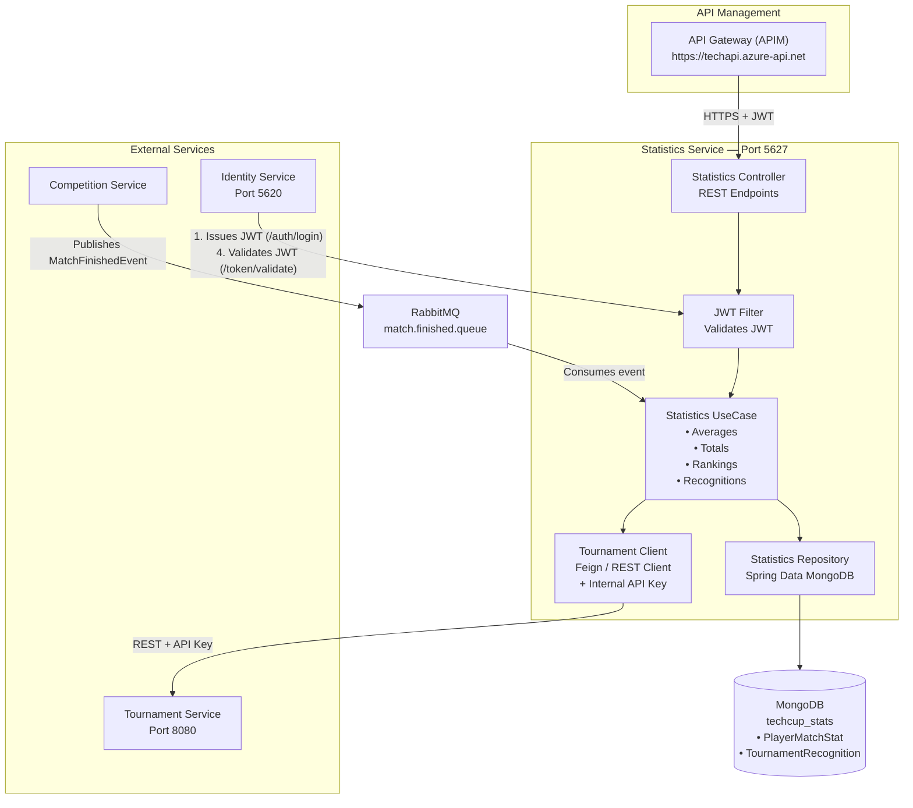
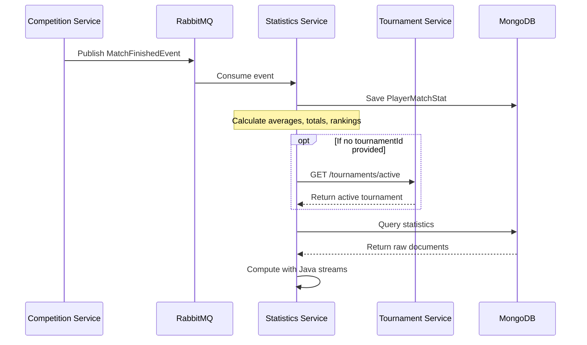
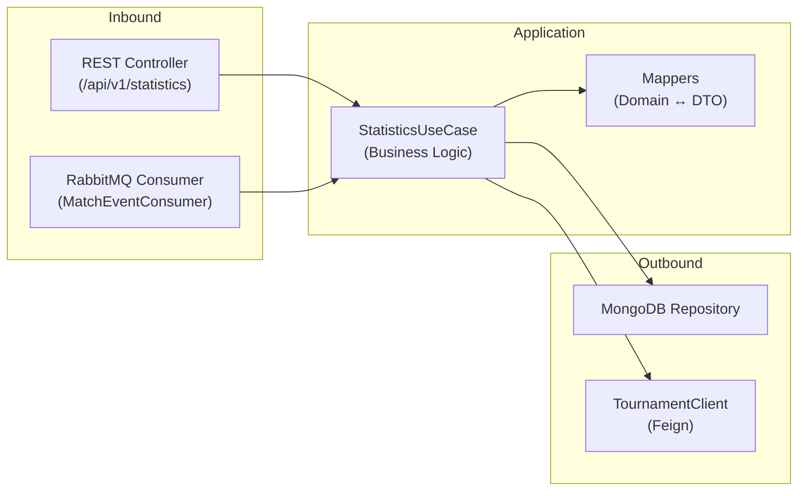
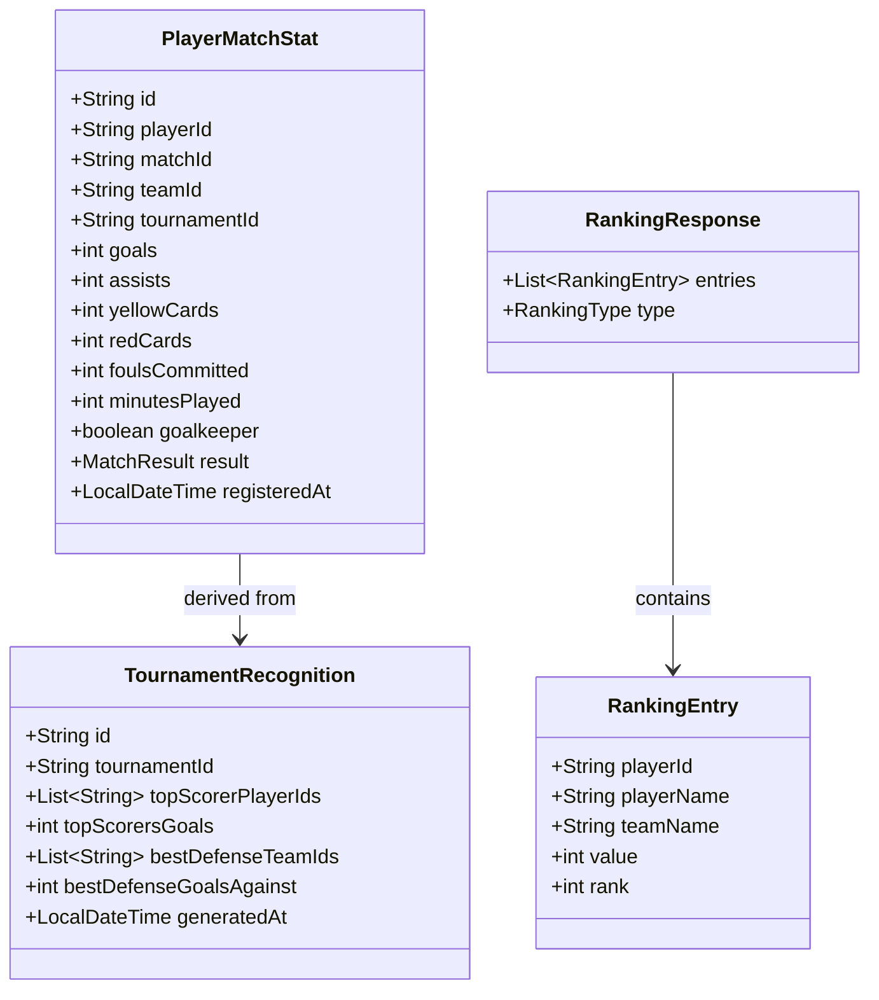
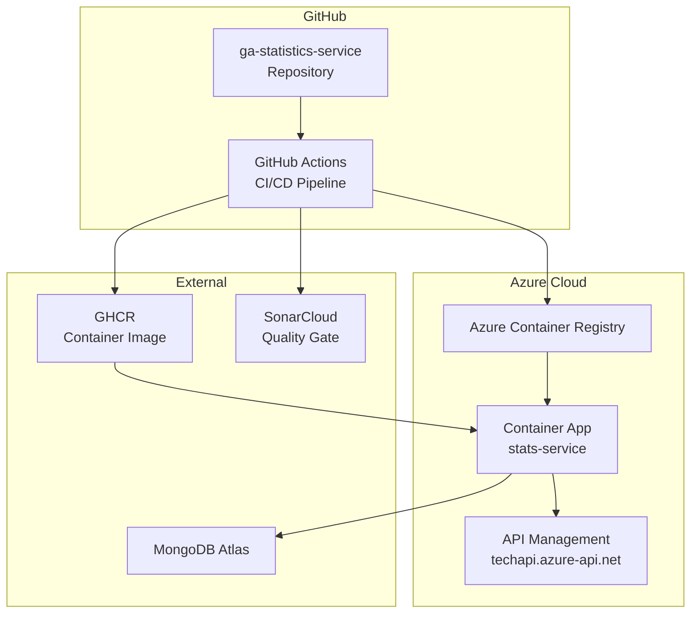

# Diagrams

## Component Diagram — Statistics Service

```mermaid
graph TB
    subgraph APIM["API Management"]
        GW["API Gateway (APIM)<br/>https://techapi.azure-api.net"]
    end

    subgraph Stats["Statistics Service — Port 5627"]
        CT["Statistics Controller<br/>REST Endpoints"]
        JF["JWT Filter<br/>Validates JWT"]
        UC["Statistics UseCase<br/>• Averages<br/>• Totals<br/>• Rankings<br/>• Recognitions"]
        RP["Statistics Repository<br/>Spring Data MongoDB"]
        TC["Tournament Client<br/>Feign / REST Client<br/>+ Internal API Key"]

        CT --> JF
        JF --> UC
        UC --> RP
        UC --> TC
    end

    subgraph External["External Services"]
        ID["Identity Service<br/>Port 5620"]
        TO["Tournament Service<br/>Port 8080"]
        CO["Competition Service"]
    end

    DB[(MongoDB<br/>techcup_stats<br/>• PlayerMatchStat<br/>• TournamentRecognition)]
    RM["RabbitMQ<br/>match.finished.queue"]

    GW -- "HTTPS + JWT" --> CT
    ID -- "1. Issues JWT (/auth/login)<br/>4. Validates JWT (/token/validate)" --> JF
    RP --> DB
    TC -- "REST + API Key" --> TO
    CO -- "Publishes MatchFinishedEvent" --> RM
    RM -- "Consumes event" --> UC
```

## Sequence Diagram — Match Event Flow

```mermaid
sequenceDiagram
    participant C as Competition Service
    participant R as RabbitMQ
    participant S as Statistics Service
    participant T as Tournament Service
    participant M as MongoDB

    C->>R: Publish MatchFinishedEvent
    R->>S: Consume event
    S->>M: Save PlayerMatchStat
    
    Note over S: Calculate averages, totals, rankings
    
    opt If no tournamentId provided
        S->>T: GET /tournaments/active
        T-->>S: Return active tournament
    end
    
    S->>M: Query statistics
    M-->>S: Return raw documents
    S->>S: Compute with Java streams
```

## Architecture Layers

```mermaid
graph LR
    subgraph "Inbound"
        API["REST Controller<br/>(/api/v1/statistics)"]
        AMQP["RabbitMQ Consumer<br/>(MatchEventConsumer)"]
    end

    subgraph "Application"
        UC["StatisticsUseCase<br/>(Business Logic)"]
        MAP["Mappers<br/>(Domain ↔ DTO)"]
    end

    subgraph "Outbound"
        REPO["MongoDB Repository"]
        CLIENT["TournamentClient<br/>(Feign)"]
    end

    API --> UC
    AMQP --> UC
    UC --> REPO
    UC --> CLIENT
    UC --> MAP
```

## Data Model

```mermaid
classDiagram
    class PlayerMatchStat {
        +String id
        +String playerId
        +String matchId
        +String teamId
        +String tournamentId
        +int goals
        +int assists
        +int yellowCards
        +int redCards
        +int foulsCommitted
        +int minutesPlayed
        +boolean goalkeeper
        +MatchResult result
        +LocalDateTime registeredAt
    }

    class TournamentRecognition {
        +String id
        +String tournamentId
        +List~String~ topScorerPlayerIds
        +int topScorersGoals
        +List~String~ bestDefenseTeamIds
        +int bestDefenseGoalsAgainst
        +LocalDateTime generatedAt
    }

    class RankingResponse {
        +List~RankingEntry~ entries
        +RankingType type
    }

    class RankingEntry {
        +String playerId
        +String playerName
        +String teamName
        +int value
        +int rank
    }

    PlayerMatchStat --> TournamentRecognition : derived from
    RankingResponse --> RankingEntry : contains
```

## Deployment Architecture

```mermaid
graph TB
    subgraph GitHub["GitHub"]
        REPO["ga-statistics-service<br/>Repository"]
        ACTIONS["GitHub Actions<br/>CI/CD Pipeline"]
    end

    subgraph Azure["Azure Cloud"]
        ACR["Azure Container Registry"]
        ACA["Container App<br/>stats-service"]
        APIM["API Management<br/>techapi.azure-api.net"]
    end

    subgraph External["External"]
        GHCR["GHCR<br/>Container Image"]
        SQ["SonarCloud<br/>Quality Gate"]
        MQ["MongoDB Atlas"]
    end

    REPO --> ACTIONS
    ACTIONS --> SQ
    ACTIONS --> ACR
    ACTIONS --> GHCR
    ACR --> ACA
    GHCR --> ACA
    ACA --> APIM
    ACA --> MQ
```
