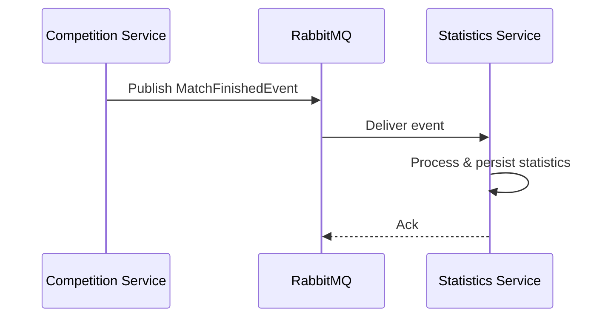

# RabbitMQ Integration

## Overview

The Statistics service consumes match events from the Competition service via RabbitMQ. When a match finishes, Competition publishes an event to the configured exchange, and this service processes and persists the statistics.

## Configuration

RabbitMQ connection is configured via `application.yml` or environment variables:

```yaml
spring:
  rabbitmq:
    host: ${RABBITMQ_HOST:localhost}
    port: ${RABBITMQ_PORT:5672}
    username: ${RABBITMQ_USER:guest}
    password: ${RABBITMQ_PASS:guest}
```

## Event flow



## Events

| Event | Exchange | Routing Key | Status |
|---|---|---|---|
| MatchFinished | `techcup.match.exchange` | `match.finished` | Implemented |
